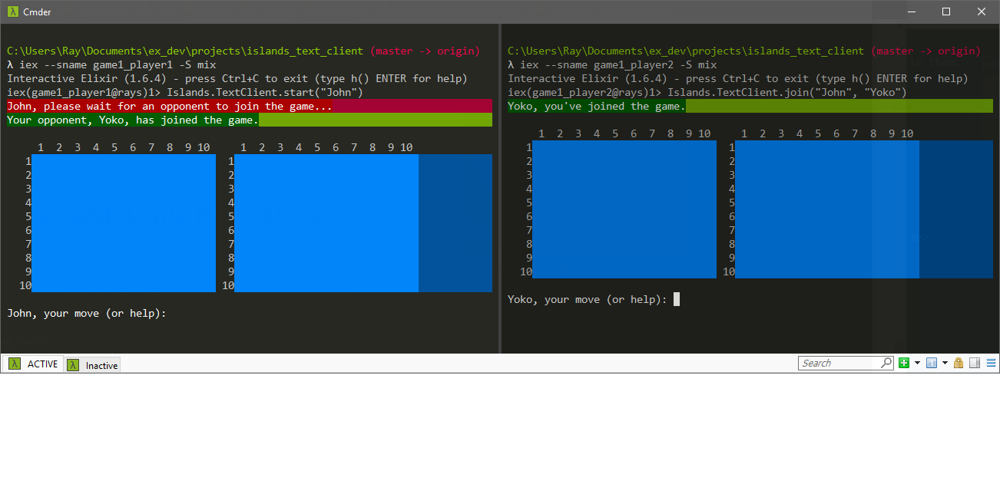
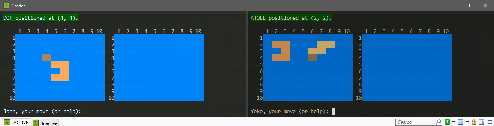
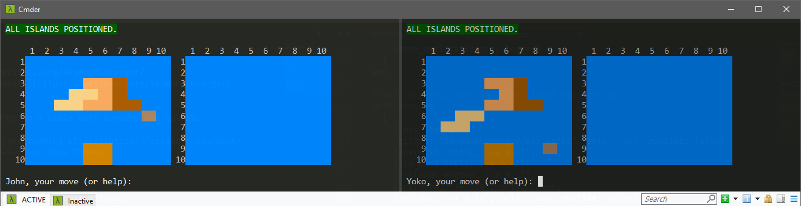

# IslandsTextClient

 Text client for the Islands game.

##### Inspired by the book [Functional Web Development](https://pragprog.com/book/lhelph/functional-web-development-with-elixir-otp-and-phoenix) by Lance Halvorsen. Also inspired by the course [Elixir for Programmers](https://codestool.coding-gnome.com/courses/elixir-for-programmers) by Dave Thomas.

## Using

To play the Islands game, clone these 2 packages from GitHub and compile them:

  - git clone https://github.com/RaymondLoranger/islands_engine
  - cd islands_engine
  - mix deps.get
  - mix compile

  - git clone https://github.com/RaymondLoranger/islands_text_client
  - cd islands_text_client
  - mix deps.get
  - mix compile

From folder `islands_engine`, run the engine in node `:islands@<hostname>`:

  - cd islands_engine
  - iex --sname islands -S mix
  - :observer.start() -- optional

The first player starts the game from a different node:

  - cd islands_text_client
  - iex --sname <game1_player1> -S mix
  - Islands.Text.start("Robin")

The second player joins the game from yet a different node:

  - cd islands_text_client
  - iex --sname <game1_player2> -S mix
  - Islands.Text.join("Robin", "Marian")

## Examples
## 
## 
## 
## 
