# Islands Text Client

Text client for the Game of Islands.

It’s a game for two players, and each player has a board, which consists of a
grid of one hundred coordinates. The grid is labeled with the numbers 1 through
10 across the top for the columns and down the left side for the rows. We name
individual coordinates with this row-column combination.

The players cannot see each other’s boards.

The players have matching sets of islands of various shapes and sizes, which
they place on their own boards. The players can move the islands around as
much as they like until they say that they are set. After that, the islands must
stay where they are for the rest of the game.

Once both players have set their islands, they take turns guessing coordinates
on their opponent’s board, trying to find the islands. For every correct guess,
we plant a palm tree on the island at that coordinate. When all the coordinates
for an island have palm trees, the island is forested.

The first player to forest all of her opponent’s islands is the winner.

##### Inspired by the book [Functional Web Development](https://pragprog.com/book/lhelph/functional-web-development-with-elixir-otp-and-phoenix) by Lance Halvorsen. Also inspired by the course [Elixir for Programmers](https://codestool.coding-gnome.com/courses/elixir-for-programmers) by Dave Thomas.

## Usage

To play the Game of Islands, clone `islands_engine` from GitHub and compile it:

  - git clone https://github.com/RaymondLoranger/islands_engine
  - cd islands_engine
  - mix deps.get
  - mix compile

Then, clone `islands_text_client` from GitHub and compile it:

  - git clone https://github.com/RaymondLoranger/islands_text_client
  - cd islands_text_client
  - mix deps.get
  - mix compile

From folder `islands_engine`, you would then run the engine in node `:islands@<hostname>` soecifying short name **islands** (required):

  - cd islands_engine
  - iex --sname **islands** -S mix
  - :observer.start() # optional to observe the game(s) being played

The first player (player1) starts the game from a different node with a short name of his choice (here **game1_player1**):

  - cd islands_text_client
  - iex --sname **game1_player1** -S mix
  - Islands.TextClient.start("__player1_name__")

The second player (player2) joins the game from yet another node with a short name of her choice (here **game1_player2**):

  - cd islands_text_client
  - iex --sname **game1_player2** -S mix
  - Islands.TextClient.join("__player1_name__", "__player2_name__")

Any number of games can be played simultaneously in this fashion.

## Example of a game's events in sequence
We start the Islands Engine specifying short name **islands** (required):
## 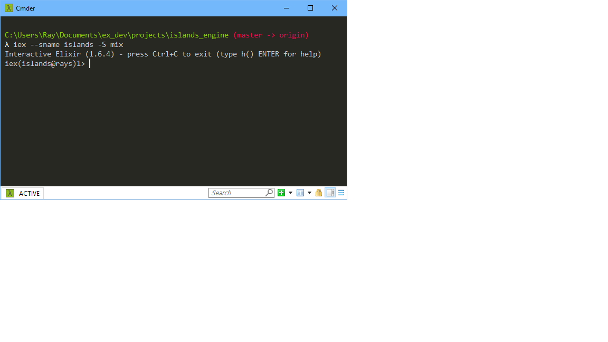
Player1 starts the game specifying short name **game1_player1** (for example):
## 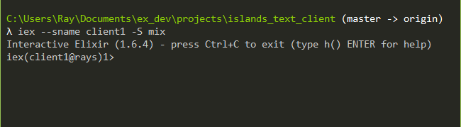
## 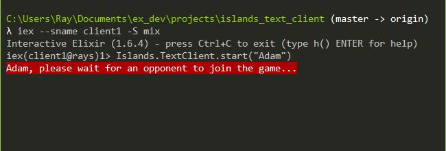
Player2 joins the game specifying short name **game1_player2** (for example):
## 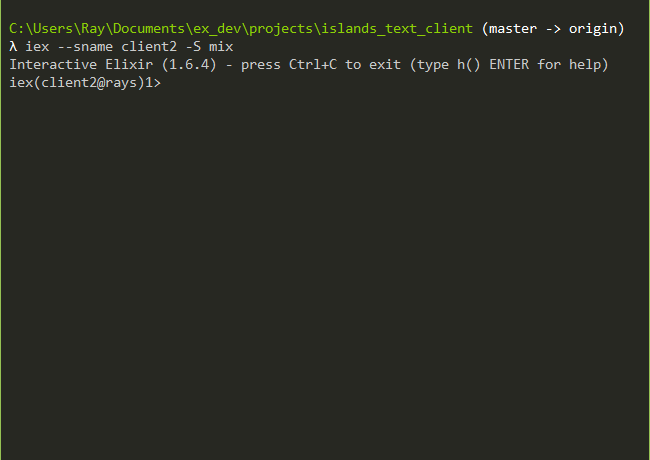
## 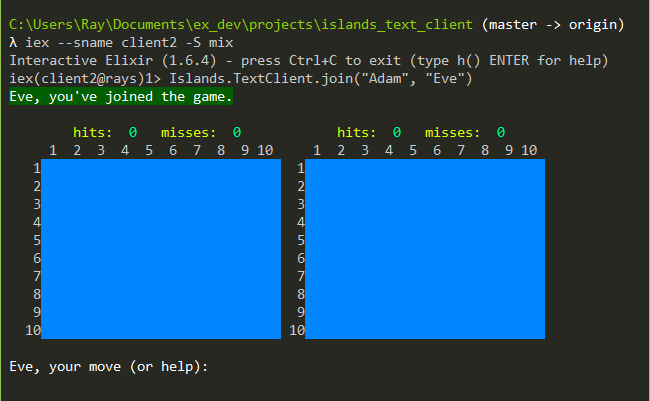
A feedback will notify player1 that an opponent has joined the game:
## 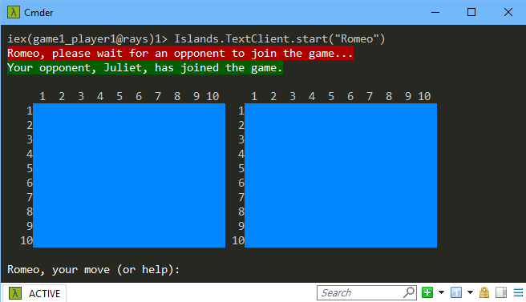
Each player must then position the 5 islands on the board (in any order):
## 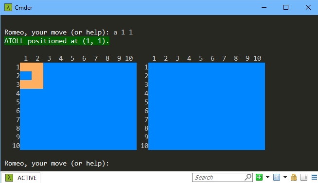
## 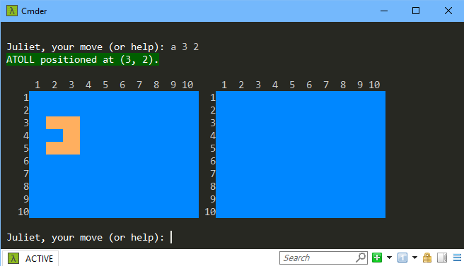
## 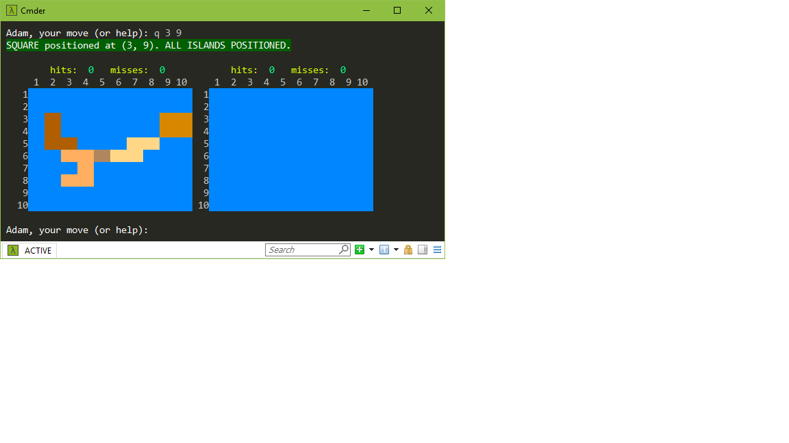
## 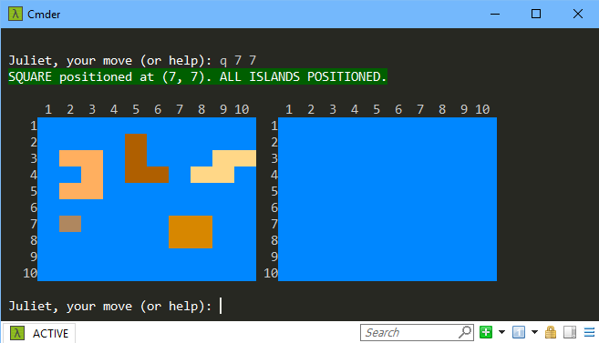
Eventually, each player declares the 5 islands "set":
## 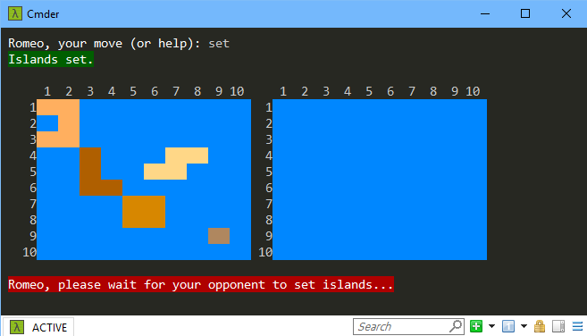
## 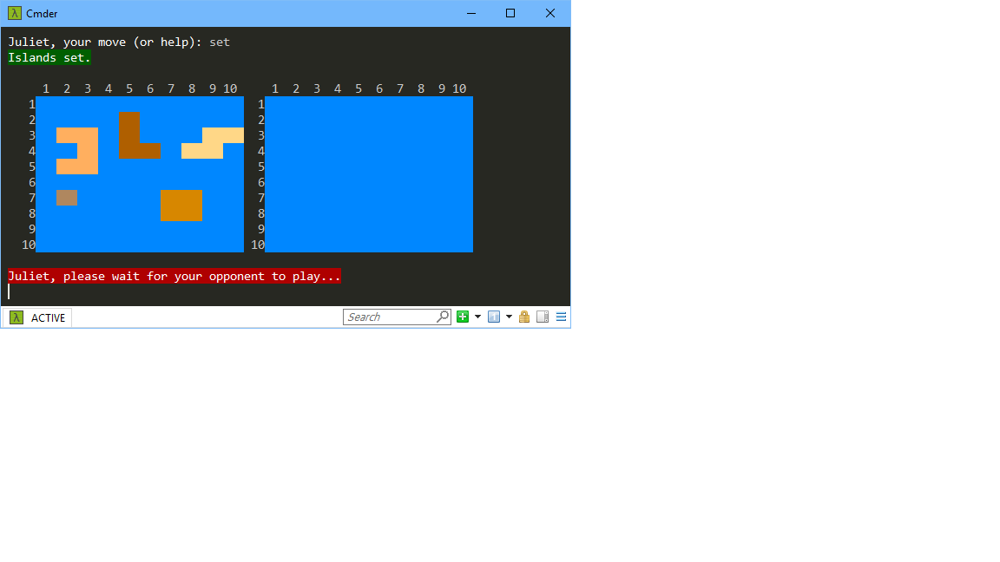
## 
Then, starting with player1, each player must make a guess **in turn**:
## 
A feedback will show what the opponent's guess was:
## 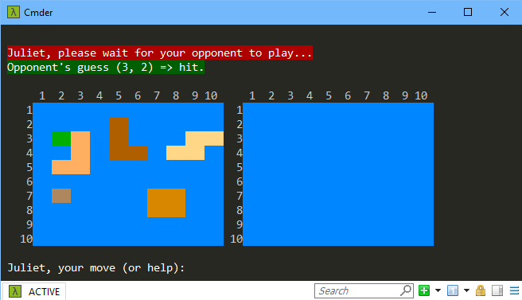
## 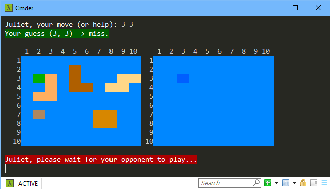
## 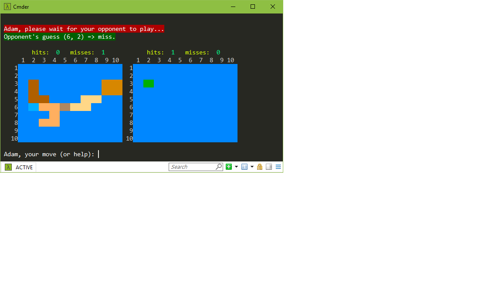
## 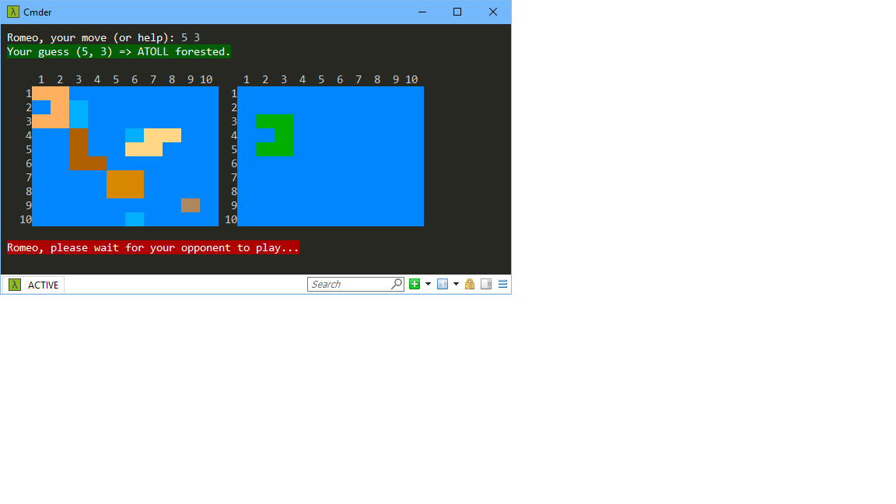
## 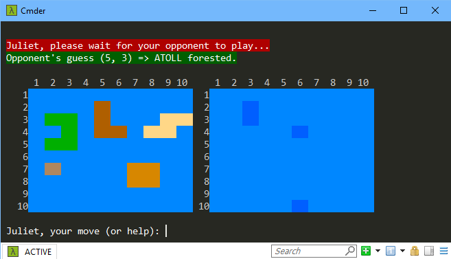
Etcetera until one player wins and the other loses...
