# Islands Text Client

Text client for the _Game of Islands_.

It’s a game for two players, and each player has a board, which consists of a
grid of one hundred coordinates. The grid is labeled with the numbers 1 through
10 across the top for the columns and down the left side for the rows. We name
individual coordinates with this row-column combination.

The players cannot see each other’s boards.

The players have matching sets of islands of various shapes and sizes, which
they place on their own boards. The players can move the islands around as
much as they like until they say that they are set. After that, the islands must
stay where they are for the rest of the game.

Once both players have set their islands, they take turns guessing coordinates
on their opponent’s board, trying to find the islands. For every correct guess,
we plant a palm tree on the island at that coordinate. When all the coordinates
for an island have palm trees, the island is forested.

The first player to forest all of her opponent’s islands is the winner.

##### Inspired by the book [Functional Web Development](https://pragprog.com/book/lhelph/functional-web-development-with-elixir-otp-and-phoenix) by Lance Halvorsen. Also inspired by the course [Elixir for Programmers](https://codestool.coding-gnome.com/courses/elixir-for-programmers) by Dave Thomas.

## Usage

To play the _Game of Islands_, clone `islands_engine` from GitHub and compile it:

  - git clone https://github.com/RaymondLoranger/islands_engine
  - cd islands_engine
  - mix deps.get
  - mix compile

Then, clone `islands_text_client` from GitHub and compile it:

  - git clone https://github.com/RaymondLoranger/islands_text_client
  - cd islands_text_client
  - mix deps.get
  - mix compile

You would then run the engine in node `:islands@<hostname>` specifying short name **islands**:

  - cd islands_engine
  - iex --sname **islands** -S mix
  - :observer.start() # optional to observe the game(s) being played

Player1 starts the game from a different node using any short name (here **game1_player1**):

  - cd islands_text_client
  - iex --sname **game1_player1** -S mix
  - ~~Islands.TextClient.start("player1_name")~~
  - Islands.TextClient.start("game_name", "player1_name")

Example:

  - cd islands_text_client
  - iex --sname client1 -S mix
  - Islands.TextClient.start("Eden", "Adam")

Player2 joins the game from yet another node using any short name (here **game1_player2**):

  - cd islands_text_client
  - iex --sname **game1_player2** -S mix
  - ~~Islands.TextClient.join("player1_name", "player2_name")~~
  - Islands.TextClient.join("game_name", "player2_name")

Example:

  - cd islands_text_client
  - iex --sname client2 -S mix
  - Islands.TextClient.join("Eden", "Eve")

Multiple games can be played simultaneously in this fashion.

## Notes

When starting a game, a player can specify "auto mode" with a pause duration
(in milliseconds) between moves:

Example:

  - cd islands_text_client
  - iex --sname client1 -S mix
  - Islands.TextClient.start("Eden", "Adam", mode: :auto, pause: 5000)

Likewise when joining a game, a player can specify "auto mode" with a pause
duration (in milliseconds) between moves:

Example:

  - cd islands_text_client
  - iex --sname client2 -S mix
  - Islands.TextClient.join("Eden", "Eve", mode: :auto, pause: 3000)

  The default mode is `:manual` and the default pause is 1 millisecond.

  Any combination of modes is possible for the two players.

## Example

We launch the Islands Engine in node **islands** (required):
## 
Player1 (Adam) starts the game from node **_client1_** (for example):
## 
## 
Player2 (Eve) joins the game from node **_client2_** (for example):
## 
## 
A feedback notifies player1 that an opponent has joined the game:
## 
A player can ask for help to know how to make a move:
## 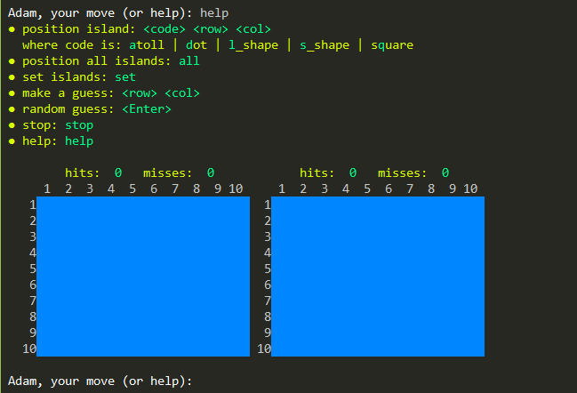
Player1 positions the 5 islands on the board (can be in any order):
## 
## 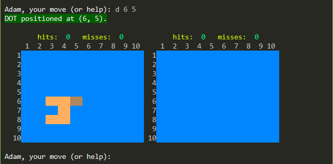
## 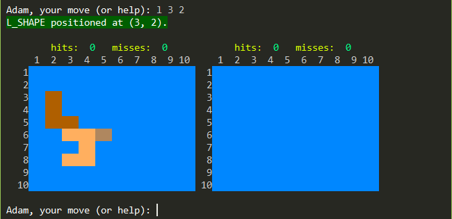
## 
## 
Player1 declares his islands "set":
## 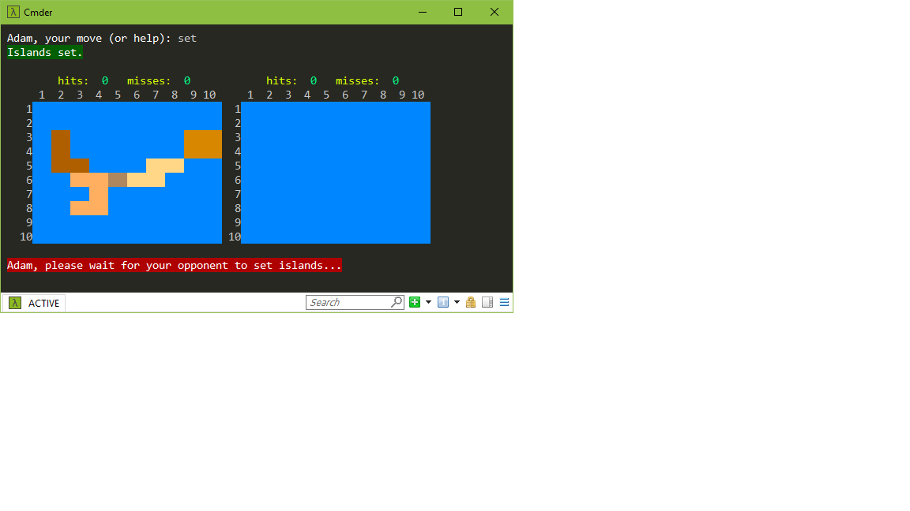
Player2 positions all her islands randomly in a single move:
## 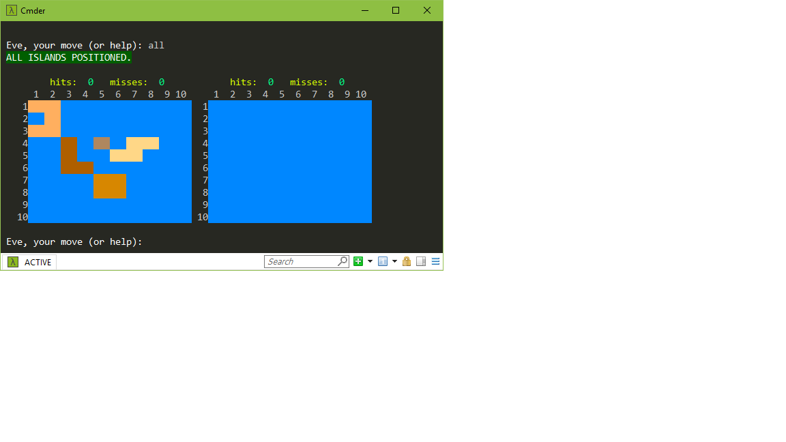
Player2 declares her islands "set":
## 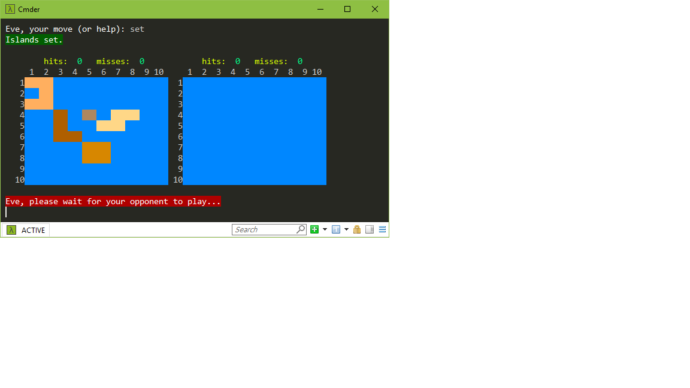
A feedback notifies player1 that his opponent has set her islands:
## 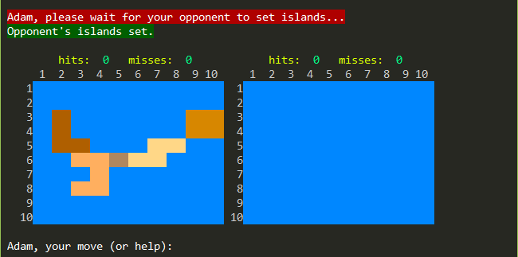
Then, starting with player1, each player must make a guess **in turn**:
## 
A feedback will show what the opponent's guess was:
## 
## 
## 
## 
## 
## 
## 
Etcetera until one player wins and the other loses...
## 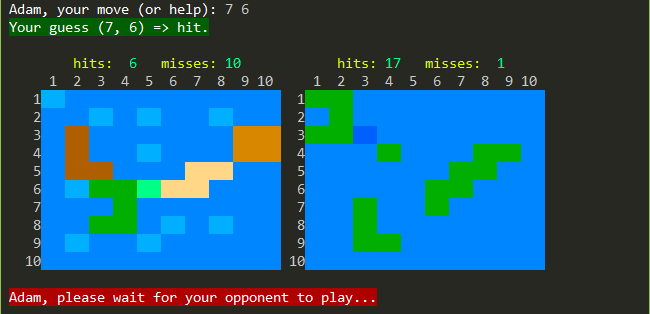
## 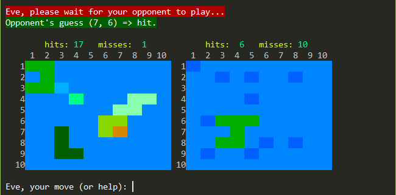
## 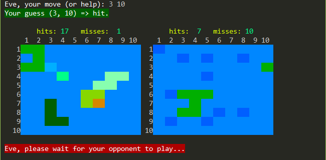
## 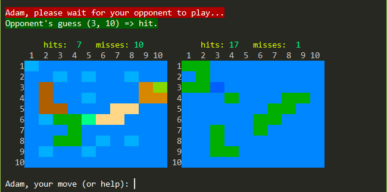
## 
## 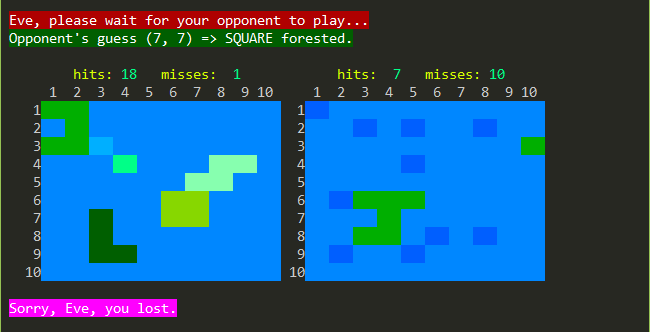
